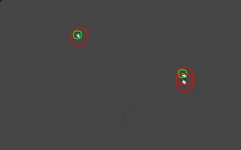

# InfraRed Small Target Detection

#### - [Paper](https://openarchive.usn.no/usn-xmlui/handle/11250/3022515)
#### - [Single-frame InfraRed Small Target (SIRST) Dataset](https://github.com/YimianDai/sirst)

---


<p align="center">
  <em>RPCA-PCP via IALM</em>
</p>
<p align="center">
  
</p>


```sh
git clone git@github.com:vj-hansen/IRSTD.git

cd IRSTD

sudo apt install \
  python3-pip \
  python3-tk \
  python3-lxml \
  python3-pil

pip install -r requirements.txt

python main.py --method "apg" --image-dir "test_imgs"
```
